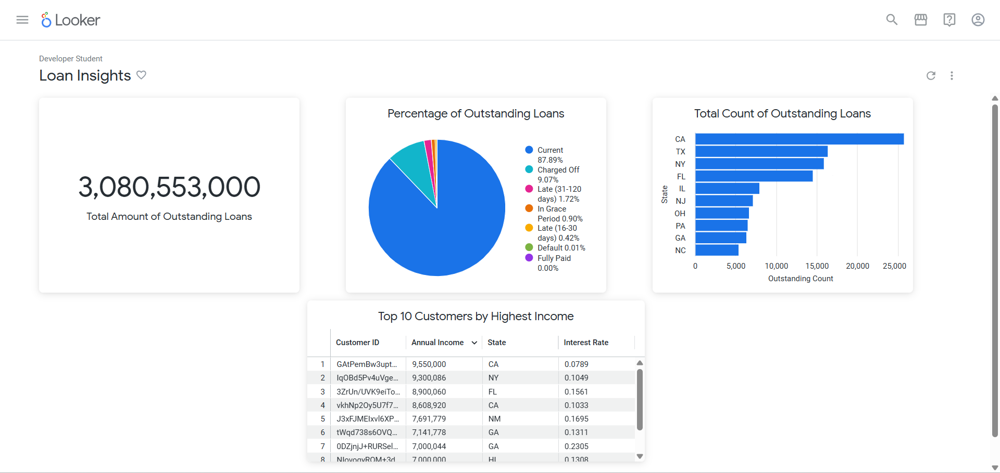
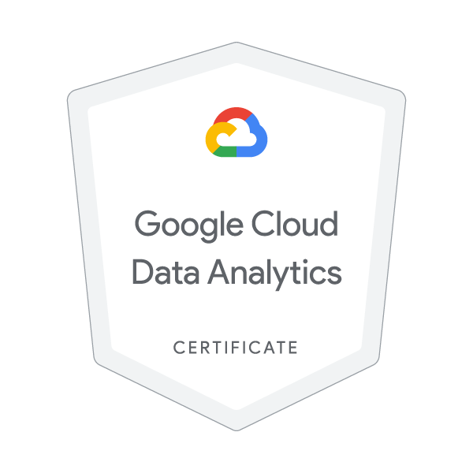

# Cloud-Based Loan Risk Analytics Dashboard  
**Google Cloud Platform | BigQuery | Looker Studio**

## Overview
This project was developed as part of the **Google Cloud Data Analytics Certification**, using GCP services including BigQuery, Cloud Storage, and Looker. It provides real-time insights into customer loan behavior, risk segmentation, and repayment trends using scalable cloud-native analytics.

The project demonstrates end-to-end data analysis from ingestion to dashboarding and is designed to help financial analysts and decision-makers understand the distribution of outstanding loans and customer income segmentation across U.S. states.

---

## Tools & Technologies

| Tool        | Purpose                                 |
|-------------|------------------------------------------|
| BigQuery    | SQL-based data processing & analysis     |
| Cloud Storage | Backend data source for querying        |
| Looker Studio | Interactive KPI dashboard & visualization |
| GCP Console | Data pipeline orchestration and access   |

---

## Project Highlights

- Processed and queried millions of rows using **BigQuery** to segment borrower income and loan behavior.
- Created a **modular Looker dashboard** with:
  - KPI: Total Outstanding Loan Amount
  - Pie Chart: Loan Status Breakdown (Current, Late, Default, etc.)
  - Bar Chart: Loan Count by State
  - Table: Top 10 Customers by Annual Income

- Focused on **real-time analysis** using SQL-optimized queries and on-the-fly transformations.
- Performed filtering, drill-downs, and region-based visual exploration.

---

## Sample Dashboard

---

## Certificate

This project was completed during the official **Google Cloud Data Analytics Certification** program using temporary GCP credentials.

---

## Limitations

- The project was executed under temporary student credentials and therefore source code, SQL queries, or datasets cannot be shared publicly.
- The dashboard is not accessible outside the GCP training environment.

---

## How to Use This Repo

This is a documentation-based project for portfolio/demo purposes. If you'd like to replicate this:
1. Use GCP BigQuery with a loan dataset (public or synthetic).
2. Build visualizations in Looker Studio or Data Studio.
3. Segment by region, income, status, or repayment trends.

---

## Author

**Mukthasree Vengoti**  
Google Cloud Data Analytics | Google Cloud Certified  
[LinkedIn Profile](https://www.linkedin.com/in/mukthasree-vengoti/)
